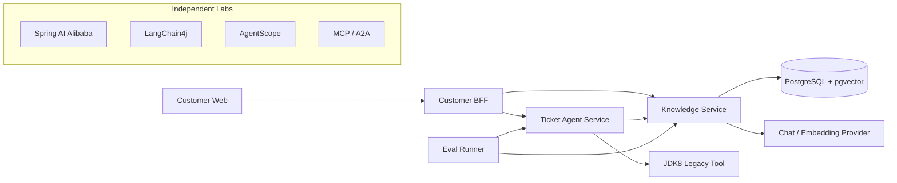

# Java AI Engineering Practice

[](https://github.com/DavidDingXu/java-ai-engineering-practice/actions/workflows/verify.yml)
[](https://github.com/DavidDingXu/java-ai-engineering-practice/actions/workflows/pgvector-integration.yml)
[](https://adoptium.net/temurin/releases/?version=21)
[](LICENSE)

一套面向企业场景的 Java AI 应用工程参考实现。项目不是框架 API 示例集合，而是围绕同一条客户服务链路，持续实现模型调用、企业 RAG、流式咨询、受控 Agent、JDK8 系统接入、评测、安全与可观测性。

项目适合已经熟悉 Java、Spring Boot 和 HTTP API，希望进一步掌握 AI 应用工程边界的开发者。默认配置不访问模型、数据库或公司网络，可以先完成构建和代码回归；真实模型与外部基础设施通过独立入口验证。

## 核心能力

- **企业知识服务**：文档版本、租户与部门 ACL、增量索引、pgvector、混合检索、引用校验和 RAG 评测。
- **客户咨询链路**：Customer Web、BFF、SSE、会话、反馈、重试和幂等工单升级。
- **受控工单 Agent**：结构化规划、Tool 参数校验、风险分级、人工确认、幂等执行、未知结果对账和审计时间线。
- **存量系统接入**：Java 8 客户端只依赖 OpenAPI 和 JSON，不与 Java 21 服务共享 DTO 或框架依赖。
- **质量与安全**：模型、检索、Agent 和安全评测，Micrometer Trace 与 Metric，低敏日志、并发限制、依赖检查和跨平台发布门禁。
- **框架与协议实验**：Spring AI Alibaba、LangChain4j、AgentScope、MCP 和 A2A 在独立 reactor 中验证，不污染主应用依赖。

## 系统架构



服务之间通过版本化 HTTP/OpenAPI 接口协作，不共享领域 JAR，也不跨服务访问数据库。系统上下文、完整时序和数据所有权见[架构文档](docs/README.md#架构与决策)。

## 快速开始

本机只需一个包含 `java` 和 `javac` 的 JDK 21 或更高版本。项目自带 Maven Wrapper，不要求额外安装 Maven，也不要求配置项目专用的 Java 环境变量。

```bash
git clone https://github.com/DavidDingXu/java-ai-engineering-practice.git
cd java-ai-engineering-practice
./mvnw verify
```

Windows PowerShell：

```powershell
git clone https://github.com/DavidDingXu/java-ai-engineering-practice.git
Set-Location java-ai-engineering-practice
.\mvnw.cmd verify
```

这条命令验证三个 Java 21 服务和 Eval Runner，不访问真实模型、数据库或外部业务网络。

## 启动本地应用

三个应用默认使用 `demo` Profile。外部模型、数据库、身份平台和远程 Tool 均关闭，未启用的业务能力会明确返回不可用，不会伪造模型或下游结果。

在三个终端中分别运行：

```bash
./mvnw -pl services/knowledge-service spring-boot:run
./mvnw -pl services/ticket-agent-service spring-boot:run
./mvnw -pl apps/customer-bff spring-boot:run
```

默认端口为 8081、8082 和 8080。可以先检查服务组装与健康状态：

```bash
curl http://localhost:8081/actuator/health
```

Customer Web 的独立运行方式见 [apps/customer-web/README.md](apps/customer-web/README.md)。完整配置说明见[运行配置](docs/runbooks/runtime-configuration.md)。

## 调用真实模型

仓库已经提供不含真实密钥的 `config/application.yml`。使用 OpenAI 时，只需把 `spring.ai.openai.api-key` 的占位值换成本地测试 Key；使用兼容服务时，再修改同一文件中的 `base-url` 和模型名。真实值不能提交。

然后直接运行 Java 集成测试：

```bash
./mvnw \
  -pl services/knowledge-service \
  -Dtest=LiveModelSmokeIT \
  -Dspring.config.additional-location=file:../../config/application.yml \
  -Djava-ai.smoke.report-path=target/live-model-smoke.md \
  test
```

本地 YAML 使用明文只为降低测试门槛。生产 API Key、数据库密码、JWT 材料和客户端密钥必须由 Secret Manager、Vault 或部署平台 Secret 覆盖，不能进入 Git、镜像层或测试报告。更多边界见[真实模型冒烟验证](docs/runbooks/live-model-smoke.md)。

## 切换到 production Profile

三个应用分别在自己的 `application.yml` 中提供 `production` 配置段。先把其中的数据库、模型、JWT、Token Exchange 和下游地址占位值替换为目标环境配置，再启动对应模块：

```bash
./mvnw -pl services/knowledge-service \
  -Dspring-boot.run.profiles=production spring-boot:run

./mvnw -pl services/ticket-agent-service \
  -Dspring-boot.run.profiles=production spring-boot:run

./mvnw -pl apps/customer-bff \
  -Dspring-boot.run.profiles=production spring-boot:run
```

Windows 使用 `mvnw.cmd`，其余参数不变。各服务的必填项如下：

- Knowledge Service：Chat/Embedding Provider、PostgreSQL/pgvector、JWT issuer/audience/JWKS 和 actor 白名单；
- Ticket Agent Service：Chat Provider、独立 PostgreSQL 和 JWT 验签参数；
- Customer BFF：客户 JWT、Token Exchange 客户端凭证，以及 Knowledge/Ticket 服务地址。

仓库根目录的 `config/application.yml` 只供真实模型专项测试使用，不会被上述启动命令自动加载。`production` 占位值未替换时，应用会在创建外部连接前停止启动并指出配置键，不会回显密钥。

该 Profile 只组装仓库已经实现的生产适配器。Knowledge Service 的上传原文仍保存在本地文件系统，Customer BFF 的会话和限流仍是进程内实现，Ticket Agent 的远程 Tool 默认关闭。完整配置和接入边界见[运行配置](docs/runbooks/runtime-configuration.md)。

## 模块说明

| 路径 | 职责 | 构建边界 |
|---|---|---|
| [`services/knowledge-service`](services/knowledge-service/README.md) | 文档、检索、RAG 与引用 | Java 21 主 reactor |
| [`services/ticket-agent-service`](services/ticket-agent-service/README.md) | 工单 Agent、Tool、确认与审计 | Java 21 主 reactor |
| [`apps/customer-bff`](apps/customer-bff/README.md) | 客户身份委托、会话与协议聚合 | Java 21 主 reactor |
| [`quality/eval-runner`](quality/eval-runner/README.md) | 模型、检索、Agent 与安全评测 | Java 21 主 reactor |
| [`apps/customer-web`](apps/customer-web/README.md) | 客户咨询前端 | Node.js 24 独立构建 |
| [`integrations/jdk8-client`](integrations/jdk8-client/README.md) | Java 8 存量系统客户端 | JDK 8 独立构建 |
| [`labs`](labs/README.md) | 框架迁移与 MCP/A2A 互操作 | 独立 Maven reactor |
| [`contracts`](contracts/README.md) | OpenAPI、JSON Schema 与接口样例 | 契约源文件 |
| [`datasets`](datasets/README.md) | Golden Set 与安全回归数据 | 版本化数据集 |

根 Maven reactor 只聚合三个服务和 Eval Runner。labs、JDK8 客户端与 Customer Web 独立构建，避免框架实验依赖、Java 8 字节码和前端工具链污染主项目。

## 技术基线

- 主 reactor：Java 21、Spring Boot 4.1.0、Spring AI 2.0.0。
- labs：Spring AI Alibaba 1.1.2.3、LangChain4j 1.18.0、AgentScope 2.0.0、MCP Java SDK 2.0.0、A2A Java SDK 1.1.0.Final。
- Java 8 客户端：独立 Maven 构建。
- Maven Wrapper：3.9.14。

依赖版本与选择边界见[版本基线](docs/version-baseline.md)。

## 验证方式

| 目标 | 命令 | 外部依赖 |
|---|---|---|
| 主应用回归 | `./mvnw verify` | 无 |
| 框架与协议实验 | `./mvnw -f labs/pom.xml verify` | 无 |
| Customer Web | `cd apps/customer-web && npm ci && npm test && npm run build` | Node.js 24 |
| Java 8 客户端 | `./mvnw -f integrations/jdk8-client/pom.xml verify` | 完整 JDK 8 |
| 全仓库验证 | `scripts/verify-unit.sh` 或 `scripts/verify-unit.ps1` | JDK 21、JDK 8、Node.js 24 |
| pgvector 集成 | CI `pgvector integration` 或外部测试 Profile | PostgreSQL + pgvector |

全仓脚本会自动寻找本机安装的完整 JDK。它是聚合验证入口，不是启动普通 Java 服务的前置条件。模型、检索、Agent 和安全的专项入口见[文档导航](docs/README.md#运行与验证)。

## 生产接入边界

`production` Profile 提供 PostgreSQL/Flyway、JWT、模型和下游 HTTP 适配器，但启用该 Profile 不等于项目已经适配任意公司的生产环境。以下能力需要在目标环境完成：

- 接入公司 IdP、密钥系统、对象存储、网关和真实 Legacy Tool；
- 将 Customer BFF 的进程内会话与限流替换为共享实现；
- 验证数据库迁移、备份恢复、并发容量、告警、回滚和未知结果对账；
- 使用真实业务分布维护评测数据、阈值和安全案例。

本机 health、单元测试或单次模型调用都不能代替这些验收。

## 文档与社区

- [文档导航](docs/README.md)：架构、ADR、Runbook、数据集与验证档案。
- [贡献指南](CONTRIBUTING.md)：开发环境、改动边界和 Pull Request 检查项。
- [安全策略](SECURITY.md)：漏洞报告范围与私密报告方式。
- [支持说明](SUPPORT.md)：使用问题、缺陷和功能建议分别如何反馈。
- [行为准则](CODE_OF_CONDUCT.md)：社区协作边界。

项目采用 [Apache License 2.0](LICENSE)。
