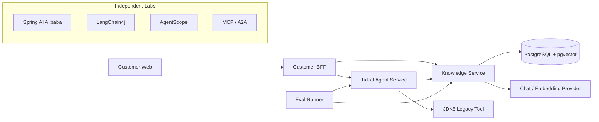

# Java AI Engineering Practice

[](https://github.com/DavidDingXu/java-ai-engineering-practice/actions/workflows/verify.yml)
[](https://github.com/DavidDingXu/java-ai-engineering-practice/actions/workflows/pgvector-integration.yml)
[](https://adoptium.net/temurin/releases/?version=21)
[](LICENSE)

一套面向企业场景的 Java AI 应用工程参考实现。项目不是框架 API 示例集合，而是围绕同一条客户服务链路，持续实现模型调用、企业 RAG、流式咨询、受控 Agent、JDK8 系统接入、评测、安全与可观测性。

项目适合已经熟悉 Java、Spring Boot 和 HTTP API，希望进一步掌握 AI 应用工程边界的开发者。代码回归不访问模型、数据库或公司网络；默认运行使用真实模型和跨服务 HTTP，本地身份与进程内状态减少了其他前置组件。

## 核心能力

- **企业知识服务**：文档版本、租户与部门 ACL、增量索引、pgvector、混合检索、引用校验和 RAG 评测。
- **客户咨询链路**：Customer Web、BFF、SSE、会话、反馈、重试和幂等工单升级。
- **受控工单 Agent**：结构化规划、Tool 参数校验、风险分级、人工确认、幂等执行、未知结果对账和审计时间线。
- **存量系统接入**：Java 8 客户端只依赖 OpenAPI 和 JSON，不与 Java 21 服务共享 DTO 或框架依赖。
- **质量与安全**：模型、检索、Agent 和安全评测，Micrometer Trace 与 Metric，低敏日志、并发限制、依赖检查和跨平台发布门禁。
- **框架与协议实验**：Spring AI Alibaba、LangChain4j、AgentScope、MCP 和 A2A 在独立 reactor 中验证，不污染主应用依赖。

## 系统架构



服务之间通过版本化 HTTP/OpenAPI 接口协作，不共享领域 JAR，也不跨服务访问数据库。系统上下文、完整时序和数据所有权见[架构文档](docs/README.md#架构与决策)。

## 快速开始

本机准备 JDK 21 或更高版本，并用 IntelliJ IDEA 打开项目根目录。第一次体验只需要启动 Knowledge Service，不必先安装数据库、身份平台或其他中间件。

```bash
git clone https://github.com/DavidDingXu/java-ai-engineering-practice.git
cd java-ai-engineering-practice
```

打开根目录的 `config/application.yml`，把 `spring.ai.openai.api-key` 换成自己的 Key。使用 OpenAI 兼容服务时，再修改同一文件中的 `base-url` 和模型名。不要提交填过真实 Key 的文件。

然后直接运行：

- `services/knowledge-service` 中的 `KnowledgeServiceApplication`；
- 启动成功后访问 `http://localhost:8081/actuator/health`；
- 再调用 `POST http://localhost:8081/api/v1/knowledge/answers` 观察真实模型回答。

macOS、Windows 的步骤相同，IDE 项目 SDK 都选择 JDK 21。

## 启动本地应用

Knowledge Service 和 Ticket Agent Service 会自动加载根目录的共享模型配置，不需要再设置环境变量或启动参数。

本地默认使用固定身份，三个服务之间通过真实 HTTP 调用；会话、Agent 任务、确认、审计和写 Tool 使用进程内实现。因此第一次运行不需要 JWT、身份平台、Redis、Kafka 或数据库，也不会用固定答案代替模型调用。

需要体验完整咨询与工单链路时，在 IDE 中依次运行三个启动类：

1. `KnowledgeServiceApplication`；
2. `TicketAgentServiceApplication`；
3. `CustomerBffApplication`。

默认端口为 8081、8082 和 8080。可以先检查服务组装与健康状态：

```bash
curl http://localhost:8081/actuator/health
```

Customer Web 的独立运行方式见 [apps/customer-web/README.md](apps/customer-web/README.md)。完整配置说明见[运行配置](docs/runbooks/runtime-configuration.md)。

## 调用真实模型

Knowledge Service 启动后，直接请求业务接口：

```bash
curl --fail-with-body \
  -H 'Content-Type: application/json' \
  -d '{"question":"退款通常多久到账？"}' \
  http://localhost:8081/api/v1/knowledge/answers
```

Windows PowerShell：

```powershell
Invoke-RestMethod -Method Post `
  -Uri "http://localhost:8081/api/v1/knowledge/answers" `
  -ContentType "application/json" `
  -Body '{"question":"退款通常多久到账？"}'
```

响应中的 `answer`、`model` 和 `citations` 来自真实运行链路。生产 API Key、数据库密码、JWT 材料和客户端密钥必须由 Secret Manager、Vault 或部署平台 Secret 覆盖，不能进入 Git、镜像层或日志。

## 手动验证完整 RAG

完整 RAG 与“模型接口能调用”不是一回事。当前实现需要以下条件同时成立：

- PostgreSQL 已安装 `vector` 和 `pg_trgm` 扩展，数据库账号可以执行 Flyway 迁移和业务读写；
- 本地 Ollama 已下载并运行 `qwen3-embedding:4b`，Chat Provider 能完成最终回答；
- 至少上传并发布一份文档，再由索引 Worker 生成 Chunk 和向量；
- 查询使用 `tenant-a / local-user / support` 这组本地固定身份，ACL 必须允许该身份读取文档。

本地文件对象存储已经内置，首次联调不需要 MinIO、Redis、Kafka 或身份平台。Query Rewrite 和 Rerank 默认关闭，也不是跑通主链路的前置条件。

配置好 Chat Provider、Ollama 和专用 PostgreSQL 后，把 Knowledge Service 的运行模式切换为完整 RAG。Ollama 只需在体验 RAG 时手动打开，不需要设为登录自启动：

```yaml
java-ai:
  knowledge:
    mode: postgres-rag
    postgres:
      jdbc-url: jdbc:postgresql://localhost:5432/java_ai_knowledge
      username: java_ai_knowledge
      password: replace-with-your-database-password
```

修改后重新运行 `KnowledgeServiceApplication`，不需要额外 Profile 或 JWT。完整的上传、发布、索引和问答步骤见[知识文档导入](docs/runbooks/knowledge-ingestion.md)。

## 接入公司基础设施

项目不提供一个含义模糊的“生产开关”。本地实现和公司实现遵循相同接口，需要哪项能力就替换对应适配器：

- Knowledge Service：将 `java-ai.knowledge.mode` 改为 `postgres-rag`，再按需把固定身份换成公司鉴权；
- Ticket Agent Service：需要重启恢复和多实例并发时，将 `java-ai.persistence.mode` 改为 `jdbc`；有真实 Legacy Tool 后，再将写 Tool 改为 HTTP；
- Customer BFF：接入公司身份平台时，将固定身份改为 JWT，并将本地委托改为 OAuth2 Token Exchange；
- 多实例部署：把 Knowledge Service 的本地原文存储，以及 Customer BFF 的进程内会话和限流替换为共享实现。

这些配置项都在各服务的 `application.yml` 中，默认值可以直接支持本地学习。生产 API Key、数据库密码、JWT 材料和客户端密钥必须由 Secret Manager、Vault 或部署平台 Secret 覆盖。完整配置和接入边界见[运行配置](docs/runbooks/runtime-configuration.md)。

## 模块说明

| 路径 | 职责 | 构建边界 |
|---|---|---|
| [`services/knowledge-service`](services/knowledge-service/README.md) | 文档、检索、RAG 与引用 | Java 21 主 reactor |
| [`services/ticket-agent-service`](services/ticket-agent-service/README.md) | 工单 Agent、Tool、确认与审计 | Java 21 主 reactor |
| [`apps/customer-bff`](apps/customer-bff/README.md) | 客户身份委托、会话与协议聚合 | Java 21 主 reactor |
| [`quality/eval-runner`](quality/eval-runner/README.md) | 模型、检索、Agent 与安全评测 | Java 21 主 reactor |
| [`apps/customer-web`](apps/customer-web/README.md) | 客户咨询前端 | Node.js 24 独立构建 |
| [`integrations/jdk8-client`](integrations/jdk8-client/README.md) | Java 8 存量系统客户端 | JDK 8 独立构建 |
| [`labs`](labs/README.md) | 框架迁移与 MCP/A2A 互操作 | 与主应用隔离的代码实验 |
| [`learning-stages`](learning-stages/README.md) | 专栏七个阶段的可运行学习切片 | 独立 reactor，不进入主应用依赖 |
| [`contracts`](contracts/README.md) | OpenAPI、JSON Schema 与接口样例 | 契约源文件 |
| [`datasets`](datasets/README.md) | Golden Set 与安全回归数据 | 版本化数据集 |

三个服务共享 Java 21 依赖基线。labs、JDK8 客户端与 Customer Web 保持独立边界，避免框架实验依赖、Java 8 字节码和前端工具链污染主项目。

## 技术基线

- 主 reactor：Java 21、Spring Boot 4.1.0、Spring AI 2.0.0。
- labs：Spring AI Alibaba 1.1.2.3、LangChain4j 1.18.0、AgentScope 2.0.0、MCP Java SDK 2.0.0、A2A Java SDK 1.1.0.Final。
- Java 8 客户端：独立 Java 8 模块。

依赖版本与选择边界见[版本基线](docs/version-baseline.md)。

## 生产接入边界

仓库提供 PostgreSQL/Flyway、JWT、模型和下游 HTTP 适配器，但拥有这些实现不等于项目已经适配任意公司的生产环境。以下能力需要在目标环境完成：

- 接入公司 IdP、密钥系统、对象存储、网关和真实 Legacy Tool；
- 将 Customer BFF 的进程内会话与限流替换为共享实现；
- 验证数据库迁移、备份恢复、并发容量、告警、回滚和未知结果对账；
- 使用真实业务分布维护评测数据、阈值和安全案例。

本机启动成功或单次模型调用都不能代替这些验收。

## 文档与社区

- [七个阶段的可运行源码](learning-stages/README.md)：读到哪一段，就直接运行对应 `Application`。
- [按专栏阶段阅读最终实现](docs/reader-code-path.md)：跑通学习切片后，再进入主工程看对应包和类。
- [文档导航](docs/README.md)：架构、ADR、Runbook、数据集与验证档案。
- [贡献指南](CONTRIBUTING.md)：开发环境、改动边界和 Pull Request 检查项。
- [安全策略](SECURITY.md)：漏洞报告范围与私密报告方式。
- [支持说明](SUPPORT.md)：使用问题、缺陷和功能建议分别如何反馈。
- [行为准则](CODE_OF_CONDUCT.md)：社区协作边界。

项目采用 [Apache License 2.0](LICENSE)。
