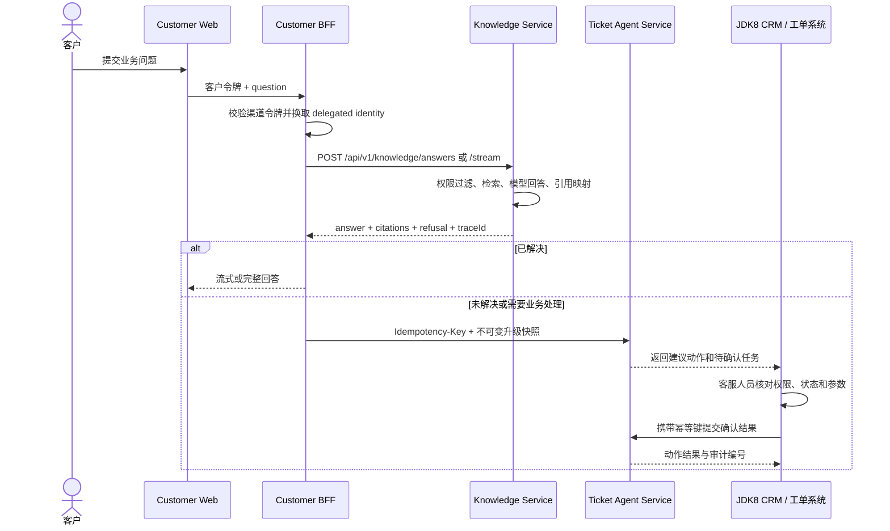

# 客户咨询与工单协同流程

## 流程目标

这条流程依次处理 C 端咨询、知识回答、工单升级和 JDK8 人工确认。第一版选择同步 HTTP/OpenAPI，是因为每次调用都有明确发起方、结果接收方和超时边界；异步消息只在出现明确的削峰、重放或跨事务需求时引入。

## 完整时序

当前已经实现 Customer Web 的流式咨询、引用、反馈、重试和转人工页面；Customer BFF 已实现固定身份、JWT、RFC 8693 Token Exchange、Knowledge HTTP/SSE 调用、短时会话和幂等工单升级；Ticket Agent Service 已实现受限规划、Tool 目录、知识查询、风险分级、版本绑定确认、确认幂等、审计、内存与 PostgreSQL/Flyway 持久化，以及内存与 HTTP Tool 适配器。默认配置使用固定身份、本地委托和进程内状态，方便直接联调；公司 IdP、目标数据库容量、生产网关与外部 JDK8 Tool 仍需在目标环境验证。

## 集成边界

1. Customer Web 只把客户令牌交给 BFF，不直接调用 Knowledge Service。
2. BFF 负责委托身份，不把 `tenantId`、`userId`、角色或部门塞进业务请求体。
3. Knowledge Service 依据受信身份和文档权限生成回答；引用必须指向实际参与回答的上下文。
4. 拒答、用户主动要求人工处理或需要修改业务状态的问题可以进入工单流程；BFF 传递的是回答尝试快照，不自行判断业务权限。
5. Ticket Agent Service 生成的是受控建议和待确认任务，不拥有最终业务写权限。
6. JDK8 系统仍是工单状态和业务写入的权威数据源，人工确认由该系统的业务终端执行。

## 失败分支

| 失败场景 | 处理方 | 必须的行为 |
|---|---|---|
| 客户令牌无效 | Customer BFF | 在渠道边界拒绝，不调用下游 |
| 委托令牌无效或受众不匹配 | Knowledge / Ticket | 下游再次拒绝，不能信任 BFF 自报身份 |
| 模型未配置 | Knowledge Service | 返回明确的 `MODEL_NOT_CONFIGURED`，不能用空字符串冒充回答 |
| 缺少可引用依据 | Knowledge Service | 返回无法回答或升级信号，不能生成无来源结论 |
| 工单已关闭或状态冲突 | JDK8 CRM / Ticket | 拒绝动作并保留审计记录 |
| 重复确认请求 | Ticket / JDK8 client | 使用幂等键返回已有结果，不重复写业务状态 |
| 下游超时 | 调用方 | 按用例配置超时、重试和熔断；非幂等写操作不得自动盲重试 |

## 数据共享规则

服务协作以版本化 HTTP/OpenAPI 接口为准，不共享领域 JAR，也不跨服务访问另一个服务的数据库。确需共享的只有 OpenAPI、JSON Schema、错误码和测试夹具；这些接口定义不包含服务内部实体或持久化模型。
