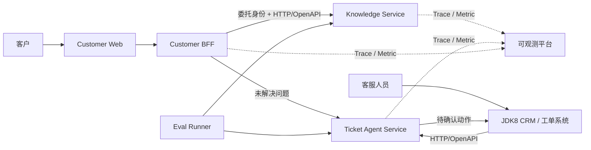

# System Context

## Status

Knowledge Service 已实现企业 RAG 主线；Customer BFF 已实现客户身份、委托令牌、完整回答、SSE、短时会话、反馈、重试和升级工单；Ticket Agent Service 已实现可信任务身份、受限步数规划、服务端 Tool 目录、人工确认、幂等、JDBC/Flyway 持久化、审计和 HTTP 下游适配器；JDK8 客户端已能查询任务并提交确认。项目同时提供 AI 安全回归、Micrometer 指标、Agent 并发容量门禁、单一运行配置、框架与协议 labs 和跨平台 release gate。正式 Customer Web、目标 PostgreSQL 容量、真实 IdP/下游联调、持久 UNKNOWN 对账和端到端容量验证仍需在目标公司环境完成。

下图同时包含当前可运行连线和后续目标。BFF 到 Knowledge 的回答/SSE、BFF 到 Ticket 的幂等升级，以及 JDK8 客户端到 Ticket 的查询和确认已经有代码；生产 CRM 的业务写入实现、回调部署和外部环境验收仍不能从图中推断已经交付。

## Business Context

项目围绕一条连续业务链展开：客户先在 C 端咨询政策或订单问题，知识服务给出带依据的回答；无法解决的问题升级为工单；客服人员在 JDK8 业务终端确认高风险动作；评测与可观测能力贯穿整条链路。

Customer BFF 是渠道边界，不复制知识或工单领域。JDK8 系统仍是工单状态和业务写入的系统记录；AI 服务不能绕过它直接修改核心业务数据。

## Executable Boundaries

| Build boundary | Current implementation | Target responsibility |
|---|---|---|
| Main reactor | Knowledge、Ticket、BFF、Eval Runner 可构建；RAG、C 端会话和幂等工单升级已形成连续 HTTP 链路 | Java 21 生产主线 |
| Framework labs | 三个隔离模块可独立构建 | 同一业务合同下的框架迁移实验 |
| JDK8 client | 使用真实 JDK8 编译和测试 | 老系统通过稳定 HTTP/OpenAPI 合同接入 |
| Customer Web | 仅保留独立产品边界 | C 端交互与流式回答展示 |

## Integration Rules

- 服务间第一版使用 HTTP/OpenAPI，不为尚不存在的消费方预建消息中间件和事件合同。
- 下游服务重新校验 delegated identity，不把请求体或 `X-User-Id`、`X-Tenant-Id` 一类头字段当成授权事实。
- 服务不共享领域 JAR，也不跨服务读取另一个服务的数据库。
- Java 8 客户端依赖版本化合同，不依赖 Java 21 DTO 或 Spring AI 类型。
- 高风险写操作必须回到 JDK8 业务终端，由具备权限的员工人工确认。
- Spring AI 类型只存在于 Knowledge Service、Ticket Agent Service 的基础设施适配器；业务端口分别使用知识问答和工单规划语义。
- Eval Runner 通过版本化 HTTP 合同执行评测，不能依赖服务实现类或直接读取生产数据库；内部评测端点使用独立 `knowledge:eval` 权限。

## Current Evidence

- 根 Maven reactor 只包含 Knowledge Service、Ticket Agent Service、Customer BFF 和 Eval Runner。
- Knowledge Service 与 Ticket Agent Service 允许在各自基础设施层引入 Spring AI Provider starter；BFF、Eval Runner、JDK8 客户端和公开合同不得依赖 Spring AI 类型。
- Customer BFF 和 Knowledge Service 使用 WebFlux；Ticket Agent Service 暂时保留 Spring MVC，等到真实流式或并发需求出现再决定是否迁移。
- 每个服务只维护一份主运行配置，并从根目录 `.env` 或部署系统读取真实模型、数据库、身份和下游参数。
- 禁用模型、进程内任务状态和关闭外部连接只存在于 `src/test`，不构成第二套运行环境。
- Provider 协议回归属于测试代码；真实模型 Smoke 与回答 Golden Set 使用受控 API，两类证据不混用。
- PostgreSQL/pgvector 由 external profile 和独立 CI 验证；当前本机不能代替真实数据库环境给出容量结论。
- 检索 Golden Set 通过 `knowledge:eval` 接口运行，输出实际排名、Embedding 模型、质量指标和 p95 延迟；本地公式测试不冒充真实检索结果。
- Customer BFF 当前使用进程内会话和限流适配器；多实例部署必须替换为支持 TTL 与原子版本控制的共享存储和共享限流器。
- Ticket Agent 的运行配置使用 PostgreSQL/Flyway 保存任务、版本、确认执行状态、请求指纹和审计；生产环境仍需验证目标数据库的事务隔离、连接池、并发、备份恢复和容量。

更细的业务时序见 [Customer Consultation Flow](customer-consultation-flow.md)，数据与职责归属见 [Service Ownership](service-ownership.md)。
