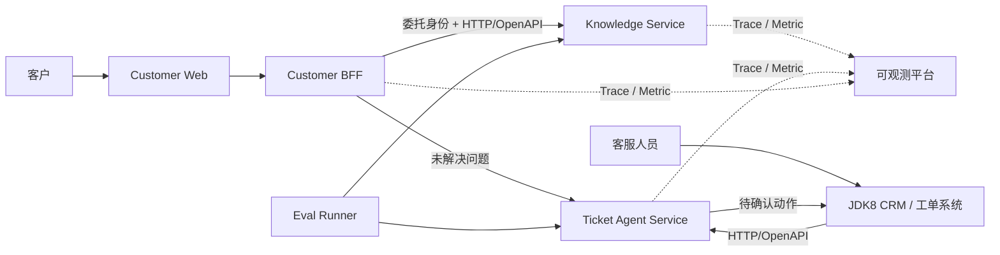

# System Context

## Status

Knowledge Service 已实现受 JWT 保护的文档上传与发布、JDBC/Flyway 持久化、pgvector 索引写入和检索；Customer BFF 已实现客户身份、委托令牌、完整回答、SSE、短时会话、反馈、重试和升级工单；Customer Web 已实现流式咨询、引用展示、反馈、重试和转人工页面；Ticket Agent Service 已实现可信任务身份、受限步数规划、服务端 Tool 目录、人工确认、幂等、JDBC/Flyway 持久化、审计和 HTTP 下游适配器；JDK8 客户端已能查询任务并提交确认。目标 PostgreSQL 容量、公司 IdP、生产网关与下游联调、持久 UNKNOWN 对账和端到端容量测试仍需在目标环境完成。

下图同时包含当前可运行连线和后续目标。BFF 到 Knowledge 的回答/SSE、BFF 到 Ticket 的幂等升级，以及 JDK8 客户端到 Ticket 的查询和确认已经有代码；生产 CRM 的业务写入实现、回调部署和外部环境验收仍不能从图中推断已经交付。

## Business Context

项目围绕一条连续业务链展开：客户先在 C 端咨询政策或订单问题，知识服务给出带依据的回答；无法解决的问题升级为工单；客服人员在 JDK8 业务终端确认高风险动作；评测与可观测能力贯穿整条链路。

Customer BFF 是渠道边界，不复制知识或工单领域。JDK8 系统仍是工单状态和业务写入的系统记录；AI 服务不能绕过它直接修改核心业务数据。

## Executable Boundaries

| Build boundary | Current implementation | Target responsibility |
|---|---|---|
| Main reactor | Knowledge、Ticket、BFF、Eval Runner 可构建；RAG、C 端会话和幂等工单升级已形成连续 HTTP 链路 | Java 21 业务主线 |
| Framework labs | 三个隔离模块可独立构建 | 使用同一业务接口、规则和数据集的框架迁移实验 |
| JDK8 client | 使用 JDK 8 独立编译和测试 | 老系统通过版本化 HTTP/OpenAPI 接口接入 |
| Customer Web | React 应用可独立构建，已接入 BFF 的命名 SSE、引用、反馈、重试和工单升级接口 | C 端咨询交互；生产登录由公司身份系统适配 |

## Integration Rules

- 服务间第一版使用 HTTP/OpenAPI，不为尚不存在的消费方预建消息中间件和事件协议。
- 下游服务重新校验 delegated identity，不把请求体或 `X-User-Id`、`X-Tenant-Id` 一类头字段当成授权事实。
- 服务不共享领域 JAR，也不跨服务读取另一个服务的数据库。
- Java 8 客户端依赖版本化 OpenAPI 和错误码，不依赖 Java 21 DTO 或 Spring AI 类型。
- 高风险写操作必须回到 JDK8 业务终端，由具备权限的员工人工确认。
- Spring AI 类型只存在于 Knowledge Service、Ticket Agent Service 的基础设施适配器；业务端口分别使用知识问答和工单规划语义。
- Eval Runner 通过版本化 HTTP 接口执行评测，不能依赖服务实现类或直接读取生产数据库；内部评测端点使用独立 `knowledge:eval` 权限。

## Current Implementation And Limits

- 根 Maven reactor 只包含 Knowledge Service、Ticket Agent Service、Customer BFF 和 Eval Runner。
- Knowledge Service 与 Ticket Agent Service 允许在各自基础设施层引入 Spring AI Provider starter；BFF、Eval Runner、JDK8 客户端和公开接口不得依赖 Spring AI 类型。
- Customer BFF 和 Knowledge Service 使用 WebFlux；Ticket Agent Service 暂时保留 Spring MVC，等到业务出现流式或高并发需求时再决定是否迁移。
- 每个服务只维护一份主运行配置，并从根目录 `.env` 或部署系统读取模型、数据库、身份和下游参数。
- 确定性模型结果、进程内任务状态和关闭外部连接只由 `src/test` 配置显式装配，不构成第二套运行环境。正式运行缺少模型配置时会返回明确错误，不会自动回退到固定答案。
- Provider 协议回归属于测试代码；模型接口 Smoke 与回答 Golden Set 使用受控 API，两者检查的内容不同，不能相互替代。
- Knowledge Service 通过 Flyway V1-V4 管理文档、ACL、任务、分块、发布审计和 `document_search_version`。发布只切换业务版本；新索引写完前继续读取上一版，sink 在写事务开始时校验 `leaseAttempt` 和租约有效期。
- `external-integration` Maven profile 提供 PostgreSQL/pgvector 集成测试入口。小数据集只能检查迁移、SQL 行为和检索版本切换，不能给出生产容量结论。
- 上传原文默认保存在本地文件目录。多实例部署需要替换为 S3 兼容对象存储，并补充对象生命周期、加密、故障补偿和孤儿清理。
- 检索 Golden Set 通过 `knowledge:eval` 接口运行，输出实际排名、Embedding 模型、质量指标和 p95 延迟；本地公式测试不能推导目标环境的检索指标。
- Customer BFF 当前使用进程内会话和限流适配器；多实例部署必须替换为支持 TTL 与原子版本控制的共享存储和共享限流器。
- Ticket Agent 的运行配置使用 PostgreSQL/Flyway 保存任务、版本、确认执行状态、请求指纹和审计；生产环境仍需验证目标数据库的事务隔离、连接池、并发、备份恢复和容量。

更细的业务时序见 [Customer Consultation Flow](customer-consultation-flow.md)，数据与职责归属见 [Service Ownership](service-ownership.md)。
